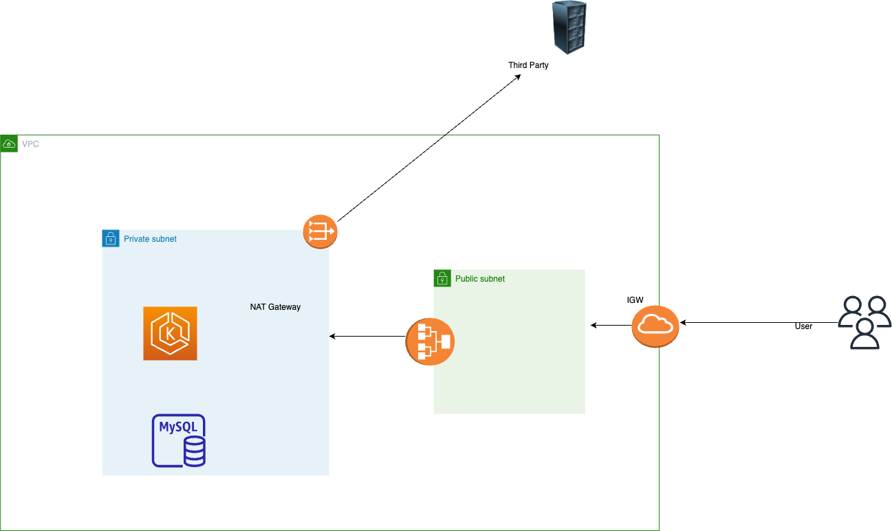

1. Add your aws profile and path to both provider and backend
2. create an s3 bucket named "test-terraform-m"
3. Run the following command to create the following resources: RDS, EKS, ECR, VPC
    terraform init
    terraform plan 
4
